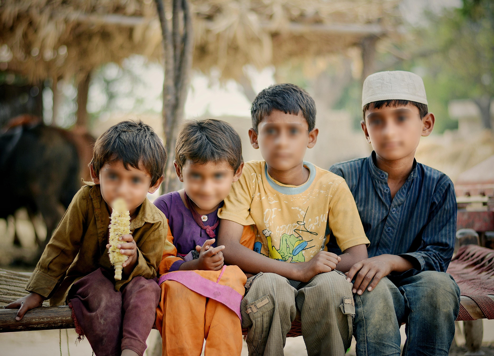

# AutomaticFaceBlur 👨‍🦲
Automatic face blur tool that **follows contour of the face** in both photos and videos.

# "Why is every face blur using rectangular or circular shapes?"

This face blur tool started with this question.
My face blur tool finds faces in an _accurate and fast_ way using pretrained RetinaFace model. This tool stands out by generating a blur mask that precisely follows the contours of the face. I utilized dlib to create a custom polygon shape by connecting facial landmarks. You can apply this tool in both image and video data. I hope this tool can be helpful in creating visually comfortable face blurring :)

### Here are some examples: <br>
<div style="display: flex; justify-content: center;">
  
  
</div>

https://github.com/PSY222/AutomaticFaceBlur/assets/86555104/bc94bc5f-dffc-4217-818a-25344181cac4


## How to use this repo 🙌
1. Clone this repo
```
git clone <<repo link>>
```

2. Navigate to 'model' folder
```
cd model
```

3. Install required packages
```
pip install -r requirements.txt
```

4. Run the command
```
python auto_blur.py -i <<input img or video path>> -o <<output img or video path>> -t <<type "img" or "video">>
```
- If you are trying to blur the image : Type "img" for the -t argument. 
- If you are trying to blur the video : Type "video" for the -t argument. 


## Some useful tips 😎
- Change the blur type or size! <br>
: Current blur is using GaussianBlur. You may try other types of blur such as median blur, blur, or bilateral filter. You can even adjust the density of blur by changing the blur size at auto_blur.py file. <br>
- Modify the code if you want to add sound to the video <br>
: You can add sound to the output video file by separately adding audio track or modifying code.
